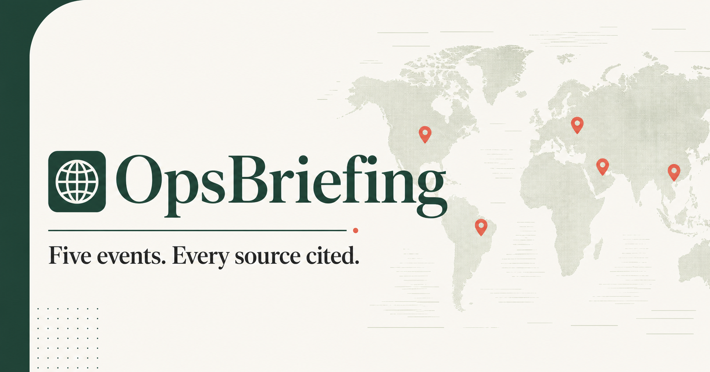
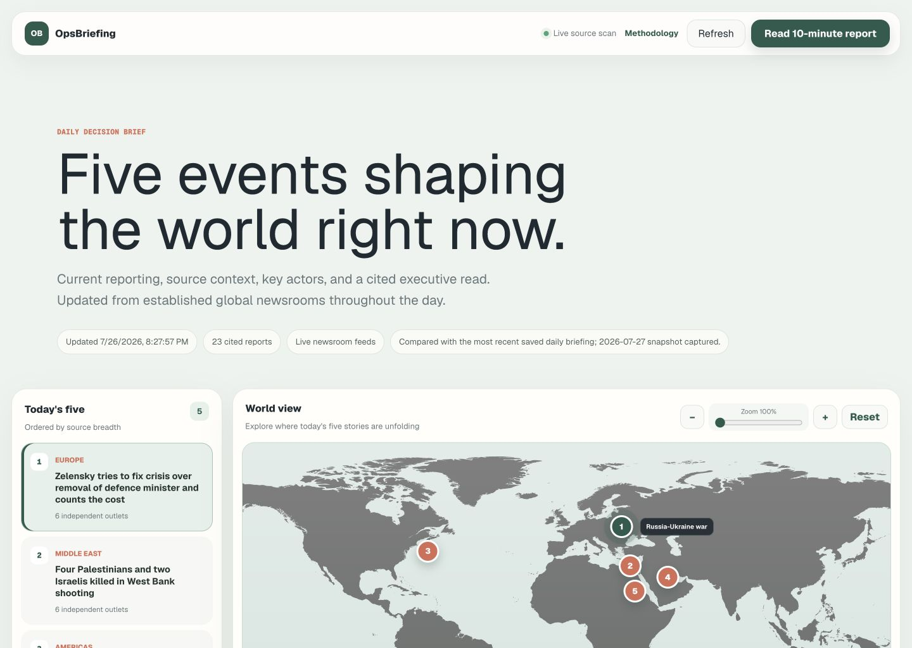
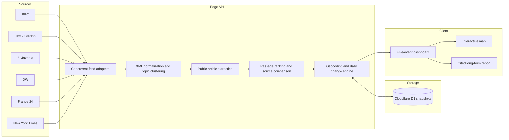

# OpsBriefing

> Five current geopolitical events. Every source cited.

[](.github/workflows/ci.yml)
[](LICENSE)

[Open the live application](https://opsbriefing-daily.coryfan2004.chatgpt.site) · [Read the methodology](METHODOLOGY.md)



OpsBriefing is a full-stack geopolitical news dashboard that transforms public reporting from six international newsrooms into five source-backed event clusters and a cited 10-minute analytical brief.

It is built as a production-oriented SWE portfolio project: concurrent ingestion, adversarial feed sanitization, deterministic clustering, real geographic coordinates, durable daily snapshots, graceful upstream failure handling, responsive visualization, fixture-based tests, CI, and Cloudflare deployment.

## Product Tour



- **Five-event queue:** orders current clusters by independent source breadth.
- **Interactive world map:** resolves place names found in reporting to latitude and longitude, with zoom-aware markers and a clickable legend.
- **Evidence view:** reads public article bodies, ranks substantive passages, and preserves numbered citations.
- **Cross-source audit:** distinguishes related coverage, distinct reporting angles, and RSS-only fallbacks.
- **Daily delta:** compares the latest briefing against the most recent saved D1 snapshot.
- **10-minute report:** combines all five events into a distraction-free cited reading view.
- **Methodology page:** exposes source selection, ranking, geocoding, change detection, and limitations.

## Architecture



## Engineering Decisions

### Evidence Before Analysis

OpsBriefing reads publicly accessible article bodies after RSS discovery, selects substantive passages, and keeps every reported passage attached to its article URL. Paywalled or restricted pages fall back to visibly labeled feed descriptions. Strategic context and uncertainties are authored separately and visibly labeled.

### Fault-Tolerant Ingestion

Feeds are fetched concurrently with `Promise.allSettled`. One unavailable publisher does not take down the briefing. Responses are cached for ten minutes to balance freshness with publisher load.

### Defensive XML Handling

Publisher feeds vary between RSS, RDF, CDATA, literal HTML, and multiply encoded entities. The parser repeatedly decodes entities, removes executable and presentation markup, collapses whitespace, and returns a consistent article contract. Synthetic fixtures preserve those edge cases without copying article text.

### Explainable Selection

Version-controlled topic dictionaries match articles into geopolitical theatres. Only one article per publisher is retained in a cluster. The five clusters with the broadest configured source representation are selected. Source breadth is an ordering signal, not a confidence score.

### Evidence-Based Geocoding

A curated gazetteer resolves supported place names found in current titles and descriptions to real coordinates. The most frequently mentioned supported location drives the marker; the UI discloses regional fallback when resolution is unavailable.

### Durable Change Detection

Cloudflare D1 stores one snapshot per event and UTC day. The API compares the current lead headline, publisher roster, source count, and mapped location with the latest prior day before writing today's snapshot.

## Stack

- React 19 and Next.js-compatible Vinext
- TypeScript
- Cloudflare Workers and D1
- Drizzle ORM migrations
- CSS responsive design without a component framework
- Node test runner with deterministic RSS/RDF fixtures
- ESLint and GitHub Actions
- OpenAI Sites deployment

## Repository Structure

```text
app/                  Dashboard, methodology page, and API route
db/                   D1 schema, access helper, and snapshot engine
drizzle/              Generated SQL migrations
lib/                  Pure feed parser and geocoding modules
public/               Basemap and social preview assets
tests/fixtures/        Synthetic publisher-format fixtures
tests/                 Parser and product contract tests
.github/workflows/     Continuous integration
```

## Local Development

Requirements: Node.js 22.13 or newer.

```bash
npm ci
npm run dev
```

The local environment runs without D1 and reports that historical comparison is available in production. Live newsroom feeds require outbound network access.

Run the complete verification suite:

```bash
npm run check
```

Generate a migration after changing `db/schema.ts`:

```bash
npm run db:generate
```

## Testing Strategy

- Parser fixtures cover CDATA, encoded HTML, RDF dates, entity decoding, and script removal.
- Geocoding tests verify that source text resolves to geographic coordinates.
- Product contract tests enforce five-event selection, citations, map controls, sanitization, and snapshot integration.
- CI runs lint, tests, and the production build on every push and pull request.

## Limitations and Roadmap

- RSS descriptions vary in depth; readers should open citations for full context.
- Publisher access controls can limit some sources to feed excerpts; OpsBriefing does not bypass them.
- The deterministic topic and location dictionaries are explainable but not exhaustive.
- Licensed wire services require separate commercial credentials.
- Future work could add semantic entity resolution, geospatial polygons, PDF/email export, and adapter-health monitoring.

See [METHODOLOGY.md](METHODOLOGY.md) for editorial boundaries and [CONTRIBUTING.md](CONTRIBUTING.md) for contribution expectations.

## License

MIT © 2026 Cory Fan
